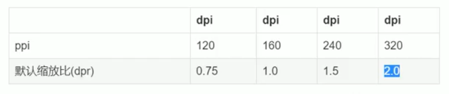

## 移动端专业术语解释


### PPI/DPI 像素密度 (Pixels per inch)/(Dots per inch)
```
PPI = 对角线分辨率/屏幕尺寸

如oppo f5 屏幕分辨率为2160*1080
对角线分辨率勾股定理得2414
PPI = 2414/6 = 402
```

### 设备像素比DPR
```
DPR = 设备像素/逻辑像素
如iphone7 设备像素750 逻辑像素275
DPR = 2 两倍屏
console.log(window.devicePixelRatio || devicePixelRatio); // 可以拿到DPR

逻辑像素也称设备独立像素DIP
```


### PPI与DPR的关系
```
PPI越大 DPR越大
```




